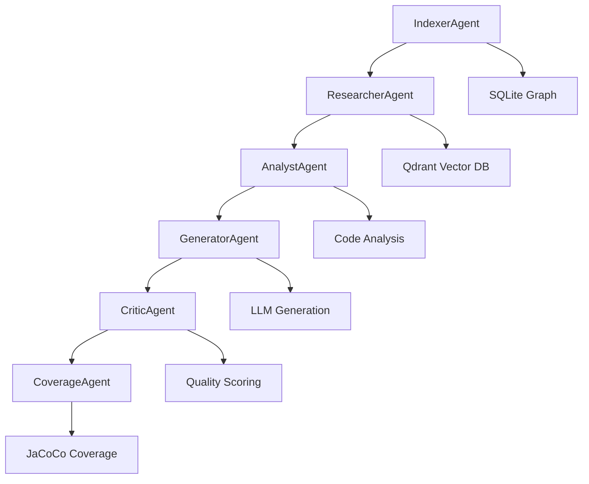

# 🤖 Java Unit Test Agent

> **Интеллектуальная система агентов с ИИ** для автоматической генерации Java unit-тестов с использованием продвинутого анализа кода, графового понимания и векторных эмбеддингов.

[](https://www.python.org/downloads/)
[](https://fastapi.tiangolo.com/)
[](https://continue.dev/)
[](https://opensource.org/licenses/MIT)

## 🌟 Ключевые возможности

### 🧠 **Мульти-агентная архитектура**
- **6 Специализированных агентов**: Индексатор, Исследователь, Аналитик, Генератор, Критик, Покрытие
- **Библиотека паттернов агентов**: Реализует 18+ архитектурных паттернов для интеллектуальных агентов
- **Гибридный интеллект**: Объединяет рассуждения LLM с графовым анализом

### 📊 **Продвинутое понимание кода**
- **Графовый анализ**: SQLite графовая база данных с марковскими прогулками для связей кода
- **Векторный поиск**: Семантический поиск кода с Qdrant и sentence transformers
- **Tree-sitter парсинг**: Точный анализ Java AST и маппинг зависимостей
- **Улучшенный марковский ходок**: Адаптивные веса и гибридные возможности поиска

### 🔍 **Интеллектуальная генерация тестов**
- **RAG-система**: Retrieval-Augmented Generation с полным контекстом кодовой базы
- **Оценка качества**: Автоматическая оценка качества тестов (шкала 0-100)
- **Обнаружение граничных случаев**: Выявляет граничные условия и сценарии ошибок
- **Генерация моков**: Автоматическое мокирование зависимостей и настройка

### 🔌 **Интеграция с IDE**
- **Continue.dev плагин**: Бесшовная интеграция с VS Code с пользовательскими командами
- **TypeScript интеграция**: Встроенный API клиент и slash-команды
- **Обратная связь в реальном времени**: WebSocket соединения для живых обновлений

### 📈 **Мониторинг и наблюдаемость**
- **LLM трассировка**: Интеграция Langfuse & LangSmith для анализа промптов
- **Дашборд метрик**: Prometheus + Grafana для мониторинга системы
- **Интерактивные визуализации**: Plotly дашборды для производительности агентов
- **Комплексное логирование**: Детальное отслеживание операций и отладка

### 🏗️ **Готовность к продакшену**
- **Реальное покрытие кода**: Интеграция JaCoCo с Gradle/Maven
- **Управление базами данных**: Автоматическая очистка и инструменты миграции
- **API документация**: OpenAPI/Swagger с интерактивным тестированием
- **Поддержка Docker**: Полное контейнеризованное развертывание

## 🚀 Быстрый старт

### Предварительные требования

- **Python 3.10+** (протестировано с Python 3.13)
- **Node.js 18+** (для интеграции Continue.dev)
- **Docker & Docker Compose**
- **VS Code** с расширением [Continue.dev](https://continue.dev)
- **Java 11+** (для измерения покрытия кода)
- **Gradle** (рекомендуется) или **Maven** (резервный)
- **OpenAI API ключ**

### 1. Клонирование и настройка

```bash
git clone <ваш-репозиторий>
cd continue-unit-test-java

# Установка зависимостей
make setup

# Настройка окружения
nano .env  # Добавьте ваш OpenAI API ключ
```

### 2. Запуск инфраструктуры

```bash
# Запуск всех сервисов
docker compose up -d

# Проверка сервисов
docker ps
```

**Запущенные сервисы:**
- **Qdrant** (Векторная БД): http://localhost:6333
- **Redis** (Кэш): http://localhost:6379
- **Grafana** (Мониторинг): http://localhost:3001
- **Prometheus** (Метрики): http://localhost:9090

### 3. Запуск Python API

```bash
cd python
python -m venv venv
source venv/bin/activate  # Linux/Mac
pip install -r requirements.txt
python api/server.py
```

API доступен по адресу: **http://localhost:8000**

### 4. Настройка Continue.dev

1. Установите расширение [Continue.dev](https://continue.dev) в VS Code
2. Отредактируйте `.continue/config.json`:
```json
{
  "models": [
    {
      "title": "OpenAI GPT-4",
      "provider": "openai",
      "model": "gpt-4",
      "apiKey": "ваш-openai-api-ключ"
    }
  ],
  "commands": [
    {
      "name": "java-test",
      "description": "Генерировать unit-тест для выбранного Java метода",
      "prompt": "Сгенерировать комплексный JUnit тест для выбранного Java метода используя RAG систему."
    }
  ]
}
```

### 5. Индексация вашего проекта

```bash
# Простая индексация
./scripts/universal_indexer.py /путь/к/вашему/java/проекту

# Или через API
curl -X POST http://localhost:8000/api/index/project \
  -H "Content-Type: application/json" \
  -d '{"project_path": "/путь/к/вашему/java/проекту"}'
```

### 6. Генерация тестов

**В VS Code:**
1. Выберите Java метод
2. Выполните: `@java-test` или `@test-rag`
3. Получите профессиональные JUnit тесты с полным контекстом!

## 🏗️ Архитектура

### Система агентов



### Архитектура базы данных

- **SQLite Graph**: Связи кода, зависимости, графы вызовов
- **Qdrant Vector**: Семантические эмбеддинги, поиск по сходству
- **Redis Cache**: Кэш эмбеддингов, данные сессий
- **Merkle Tree**: Обнаружение изменений, инкрементальные обновления

### RAG пайплайн

1. **Индексация кода**: Парсинг Java файлов → Построение графа → Генерация эмбеддингов
2. **Получение контекста**: Марковские прогулки + Векторный поиск → Сбор релевантного контекста
3. **Генерация тестов**: LLM + Контекст → Генерация комплексных тестов
4. **Оценка качества**: Автоматическое оценивание и предложения по улучшению

## 📊 Примеры использования

### Генерация теста для метода

```java
public class Calculator {
    public int add(int a, int b) {
        return a + b;
    }
}
```

**Команда:** `@test-rag`

**Сгенерированный тест:**
```java
@Test
void testAdd_ShouldReturnCorrectSum_WhenGivenValidInputs() {
    // Arrange
    Calculator calculator = new Calculator();
    int a = 5;
    int b = 3;
    int expectedSum = 8;
    
    // Act
    int result = calculator.add(a, b);
    
    // Assert
    assertEquals(expectedSum, result);
}

@Test
void testAdd_ShouldHandleNegativeNumbers_WhenGivenNegativeInputs() {
    // Arrange
    Calculator calculator = new Calculator();
    int a = -5;
    int b = -3;
    int expectedSum = -8;
    
    // Act
    int result = calculator.add(a, b);
    
    // Assert
    assertEquals(expectedSum, result);
}
```

### Использование API

```bash
# Индексация проекта
curl -X POST http://localhost:8000/api/index/project \
  -H "Content-Type: application/json" \
  -d '{"project_path": "/путь/к/проекту"}'

# Генерация теста
curl -X POST http://localhost:8000/api/generate-test \
  -H "Content-Type: application/json" \
  -d '{"method_id": "method:123", "framework": "junit5"}'

# Получение статистики
curl http://localhost:8000/api/stats
```

## 🔧 Конфигурация

### Переменные окружения

```bash
# Обязательные
OPENAI_API_KEY=ваш-openai-api-ключ

# Опциональные - LLM трассировка
LANGFUSE_PUBLIC_KEY=ваш-langfuse-публичный-ключ
LANGFUSE_SECRET_KEY=ваш-langfuse-секретный-ключ
LANGFUSE_HOST=https://ваш-langfuse-хост

# Опциональные - База данных
QDRANT_HOST=localhost
QDRANT_PORT=6333
REDIS_HOST=localhost
REDIS_PORT=6379

# Опциональные - Производительность
EMBEDDING_CACHE_TTL=3600
MAX_CONTEXT_SIZE=8000
```

### Конфигурация агентов

```python
# Пользовательские настройки агентов
GENERATOR_AGENT = {
    "temperature": 0.7,
    "max_tokens": 2000,
    "test_framework": "junit5"
}

RESEARCHER_AGENT = {
    "num_walks": 5,
    "walk_steps": 10,
    "vector_limit": 20
}
```

## 📈 Мониторинг и наблюдаемость

### Дашборды Grafana

- **Производительность агентов**: Использование токенов, время отклика, показатели успеха
- **RAG метрики**: Результаты векторного поиска, качество контекста, воронка получения
- **Здоровье системы**: Соединения с БД, использование памяти, частота ошибок

### LLM трассировка

- **Langfuse**: Анализ промптов, использование токенов, отслеживание затрат
- **LangSmith**: Потоки разговоров, взаимодействия агентов
- **Пользовательские метрики**: Оценки качества, покрытие тестов, время генерации

### Инструменты визуализации

```bash
# Генерация дашборда метрик агентов
python scripts/visualization/visualize_metrics.py --output dashboard.html

# Генерация анализа RAG
python scripts/visualization/visualize_rag.py --chart search --query calculateTotal

# Просмотр статистики системы
curl http://localhost:8000/api/visualization/dashboard
```

## 🧪 Тестирование и качество

### Возможности генерации тестов

- **Комплексное покрытие**: Обычные случаи, граничные случаи, сценарии ошибок
- **Интеграция моков**: Автоматическое мокирование зависимостей с Mockito
- **Качество утверждений**: Осмысленные утверждения с описательными сообщениями
- **Поддержка фреймворков**: JUnit 4/5, TestNG с правильными аннотациями

### Метрики качества

- **Автоматическое оценивание**: Оценка качества 0-100 с детальной обратной связью
- **Анализ покрытия**: Реальное измерение покрытия кода с JaCoCo
- **Предложения по улучшению**: Конкретные рекомендации для улучшения тестов
- **Метрики производительности**: Время генерации, использование токенов, анализ затрат

### Интеграция покрытия кода

```bash
# Запуск тестов с покрытием
./gradlew test jacocoTestReport

# Просмотр отчета покрытия
open build/reports/jacoco/test/html/index.html

# API эндпоинт покрытия
curl http://localhost:8000/api/coverage/project/ваш-id-проекта
```

## 🔌 Справочник API

### Основные эндпоинты

| Эндпоинт | Метод | Описание |
|----------|--------|----------|
| `/api/index/project` | POST | Индексация Java проекта |
| `/api/generate-test` | POST | Генерация unit-теста |
| `/api/stats` | GET | Статистика проекта |
| `/api/coverage/project/{id}` | GET | Метрики покрытия |
| `/api/clear` | POST | Очистка баз данных |
| `/health` | GET | Проверка здоровья |

### WebSocket события

```javascript
// Подключение к WebSocket
const ws = new WebSocket('ws://localhost:8000/ws');

// Прослушивание событий
ws.onmessage = (event) => {
  const data = JSON.parse(event.data);
  console.log('Событие:', data.type, data);
};
```

**Типы событий:**
- `indexing_started` - Начало индексации проекта
- `test_generated` - Генерация теста завершена
- `coverage_updated` - Метрики покрытия обновлены
- `error_occurred` - Уведомление об ошибке

## 🛠️ Разработка

### Структура проекта

```
continue-unit-test-java/
├── python/                    # Python бэкенд
│   ├── agents/               # AI агенты
│   ├── api/                  # FastAPI сервер
│   ├── database/             # Клиенты баз данных
│   ├── embedding/            # Векторные эмбеддинги
│   ├── graph/                # Графовый анализ
│   ├── parser/               # Парсинг Java
│   └── visualization/        # Визуализация метрик
├── typescript/               # Интеграция Continue.dev
│   ├── src/                  # TypeScript исходники
│   └── dist/                 # Собранный плагин
├── scripts/                  # Утилитарные скрипты
├── docs/                     # Документация
├── examples/                 # Примеры проектов
└── tests/                    # Наборы тестов
```

### Сборка из исходников

```bash
# Сборка TypeScript плагина
cd typescript && npm run build

# Установка Python зависимостей
cd python && pip install -r requirements.txt

# Запуск тестов
python -m pytest tests/

# Форматирование кода
black python/ && isort python/
```

### Вклад в проект

1. Форкните репозиторий
2. Создайте ветку функции
3. Внесите изменения
4. Добавьте тесты
5. Отправьте pull request

## 📚 Документация

- **[Документация API](http://localhost:8000/docs)** - Интерактивная документация API
- **[Руководство по использованию](docs/USAGE_GUIDE.md)** - Подробные инструкции по использованию
- **[Руководство по архитектуре](docs/ARCHITECTURE.md)** - Архитектура системы
- **[Паттерны агентов](docs/AGENT_PATTERNS.md)** - Детали реализации агентов
- **[Руководство по визуализации](docs/VISUALIZATION_GUIDE.md)** - Настройка мониторинга
- **[Устранение неполадок](docs/TROUBLESHOOTING.md)** - Частые проблемы и решения

## 🚨 Устранение неполадок

### Частые проблемы

**API не запускается:**
```bash
# Проверка Python окружения
cd python && python -c "import fastapi; print('OK')"

# Проверка зависимостей
pip install -r requirements.txt

# Проверка логов
tail -f logs/api.log
```

**Continue.dev не работает:**
```bash
# Пересборка TypeScript плагина
cd typescript && npm run build

# Проверка расширения VS Code
# Установите расширение Continue.dev
```

**Проблемы с подключением к БД:**
```bash
# Проверка Docker сервисов
docker ps

# Перезапуск сервисов
docker compose down && docker compose up -d

# Проверка логов
tail -f logs/database.log
```

### Оптимизация производительности

- **Увеличьте TTL кэша эмбеддингов** для повторных запросов
- **Настройте лимиты векторного поиска** в зависимости от размера проекта
- **Используйте пакетную обработку** для больших проектов
- **Мониторьте использование памяти** с дашбордами Grafana

## 🎯 Команды Make

Проект включает удобные команды Make для управления:

```bash
# Основные команды
make setup          # Первоначальная настройка
make start          # Запуск всех сервисов
make stop           # Остановка всех сервисов
make restart        # Перезапуск всех сервисов

# Разработка
make dev            # Запуск среды разработки
make test           # Запуск всех тестов
make lint           # Проверка кода
make format         # Форматирование кода

# База данных
make db-health      # Проверка здоровья БД
make db-reset       # Сброс всех БД (ОСТОРОЖНО!)

# Утилиты
make index PROJECT=/путь/к/проекту  # Индексация проекта
make stats          # Показать статистику
make health         # Проверка здоровья API
make clean          # Очистка временных файлов
make monitoring     # Открыть дашборды мониторинга

# Помощь
make help           # Показать все доступные команды
```

## 📄 Лицензия

Этот проект лицензирован под лицензией MIT - см. файл [LICENSE](LICENSE) для деталей.

## 🙏 Благодарности

- **[Библиотека паттернов агентов](https://github.com/DmitryShinkarev/agent-patterns)** - Основная архитектура агентов
- **[Continue.dev](https://continue.dev)** - Фреймворк интеграции с IDE
- **[LangChain](https://langchain.com)** - Оркестрация LLM
- **[Qdrant](https://qdrant.tech)** - Векторная база данных
- **[Tree-sitter](https://tree-sitter.github.io)** - Парсинг кода

## 📞 Поддержка

- **Проблемы**: [GitHub Issues](https://github.com/ваш-репозиторий/issues)
- **Обсуждения**: [GitHub Discussions](https://github.com/ваш-репозиторий/discussions)
- **Документация**: [Wiki проекта](https://github.com/ваш-репозиторий/wiki)

---

**Сделано с ❤️ для Java сообщества**

## 🔗 Полезные ссылки

- [Официальная документация FastAPI](https://fastapi.tiangolo.com/)
- [Документация Continue.dev](https://continue.dev/docs)
- [Руководство по Qdrant](https://qdrant.tech/documentation/)
- [Документация LangChain](https://python.langchain.com/)
- [Tree-sitter для Java](https://tree-sitter.github.io/tree-sitter/)

## 📊 Статистика проекта

- **6 AI агентов** для различных задач
- **18+ архитектурных паттернов** для интеллектуальных агентов
- **Поддержка JUnit 4/5 и TestNG**
- **Интеграция с JaCoCo** для реального покрытия кода
- **RAG система** с семантическим поиском
- **Полная интеграция с VS Code** через Continue.dev
